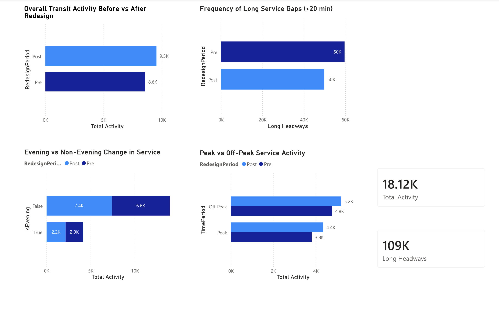

# Winnipeg Transit Redesign Analysis — Power BI Dashboard

## Overview

This project is an end-to-end analytics dashboard built using publicly available Winnipeg Transit data.  
It was created as a portfolio project to demonstrate practical data analytics skills across **Python, SQL, and Power BI**, with a focus on **clear, decision-oriented reporting** rather than raw data exploration.

The analysis examines how scheduled transit activity and service regularity changed **before vs after Winnipeg Transit’s system redesign**, using a small set of realistic, well-defined questions.

---

## Why this project

This project mirrors how analytics work is typically done in practice:

- Start from raw data
- Clean and prepare it using scripting tools
- Validate results using SQL
- Build a clear, interpretable dashboard for stakeholders

Rather than attempting to evaluate policy decisions or prove causation, the goal is to **surface high-level patterns** that help frame discussion around service changes.

---

## Data & Preparation

**Data source**
- Publicly available Winnipeg Transit schedule data (GTFS-style files)

**Preparation workflow**
1. **Python (Pandas)**
   - Combined pre- and post-redesign datasets
   - Standardised time formats
   - Created derived features such as:
     - Hour of day
     - Peak vs off-peak period
     - Evening indicator
   - Computed service headways (time gaps between scheduled events)
   - Exported cleaned datasets for downstream use

2. **SQL (SQLite)**
   - Loaded cleaned datasets into a relational database
   - Wrote validation and aggregation queries to:
     - Compare pre vs post activity
     - Analyse evening/off-peak usage
     - Identify long service gaps (“dead zones”)
   - Verified that SQL results matched Power BI measures

3. **Power BI**
   - Built a semantic model using cleaned datasets
   - Defined KPIs and measures using DAX
   - Created a single-page dashboard focused on interpretability

---

## Questions explored

The dashboard answers four core questions:

### 1. Did overall transit activity change after the redesign?
A high-level comparison of scheduled activity before vs after the system redesign.

### 2. Did evening and off-peak usage change?
Examines whether activity increased outside traditional peak hours, reflecting public discussion around improved evening service.

### 3. Did the redesign reduce long service gaps (“dead zones”)?
Uses long headways (>20 minutes) as a proxy for low-service periods.

### 4. Did off-peak usage change more than peak usage?
Compares shifts between peak and off-peak periods to understand where changes were most pronounced.

---

## Key KPIs

The dashboard summarises results using a small set of high-level KPIs:

- **Total Scheduled Activity**
- **Number of Long Headways (>20 min)**

These KPIs are designed to provide quick context before exploring the supporting visuals.

---

## Dashboard

> *Screenshot of the final Power BI dashboard*

**Design choices**
- Single-page layout
- KPI cards for quick summary
- Bar charts for clear pre/post comparisons
- Consistent colour mapping across visuals

---

## Tools & Technologies

- **Python (Pandas)** — data cleaning, feature engineering, headway calculation  
- **SQL (SQLite)** — aggregation, validation, and cross-checking results  
- **Power BI**
  - Power Query for ingestion
  - DAX for KPIs and measures
  - Interactive visuals for reporting

---

## Notes & limitations

- This analysis is **exploratory and descriptive**
- It does not attempt to measure ridership, demand, or service quality directly
- Results reflect scheduled service patterns, not observed passenger behaviour

---

## About me

Computer Science student at the University of Manitoba with interests in data analytics, data science, AI/ML, and scalable software systems.
